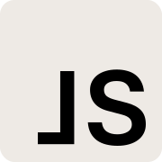

<p>
  <a href="https://joonassandell.com">
    
  </a>
</p>

# Portfolio of Joonas Sandell

<p>
  <a href="https://joonassandell.com">
    
  </a>
</p>

Welcome to the source code of [joonassandell.com](https://joonassandell.com). This is a [Next.js](https://nextjs.org/) app bootstrapped with [create-next-app](https://github.com/vercel/next.js/tree/canary/packages/create-next-app).

Even though there's no explicit `LICENSE` included my sincere hope is that you'll utilize it solely for _educational purposes, to study and gain insights_. **Please refrain from engaging in any commercial activities with the code, such as selling it or using it to develop your own website**. This approach has been effective previously, and I aim to maintain the code open for everyone. However, if I detect any unauthorized usage online, I may have to make this repository private again. Your cooperation and understanding are greatly appreciated!

- [The Portfolio](https://joonassandell.com)
- [Notes](https://github.com/joonassandell/joonassandell-portfolio/wiki/Notes)
- [Links](https://github.com/joonassandell/joonassandell-portfolio/wiki/Links)
- [Documentation (private)](https://www.notion.so/joonassandell/Readme-690a861b326e430395ddcae8d017cbf6?pvs=4)
- [Todo & Issues (private)](https://www.notion.so/joonassandell/09255e8ef2934c50ae4cd8994bad29d6?v=3ac6de3229434d31b434db726dc4b0fc&pvs=4)

## Getting started

```
git clone git@github.com:joonassandell/joonassandell-portfolio.git
cd joonassandell-portfolio
npm install
npm run dev
```

## Scripts

- `npm run dev`: Run a development server and open [localhost:3000](https://localhost:3000) with your browser to see the result
- `npm run build`: Build the application
- `npm run preview`: Build the application and preview it locally
- `npm run start`: Start the application in production mode. The application should be build first.
- `npm run deploy:preview`: [Deploy preview](https://vercel.com/docs/concepts/deployments/preview-deployments) of the application to Vercel with [Vercel CLI](https://vercel.com/docs/cli). Note that this deploys current local copy no matter of the git state.

Read environment variable descriptions from [.env.development](.env.development).

## Copyright

Copyright © 2024 [Joonas Sandell](https://x.com/joonassandell)
